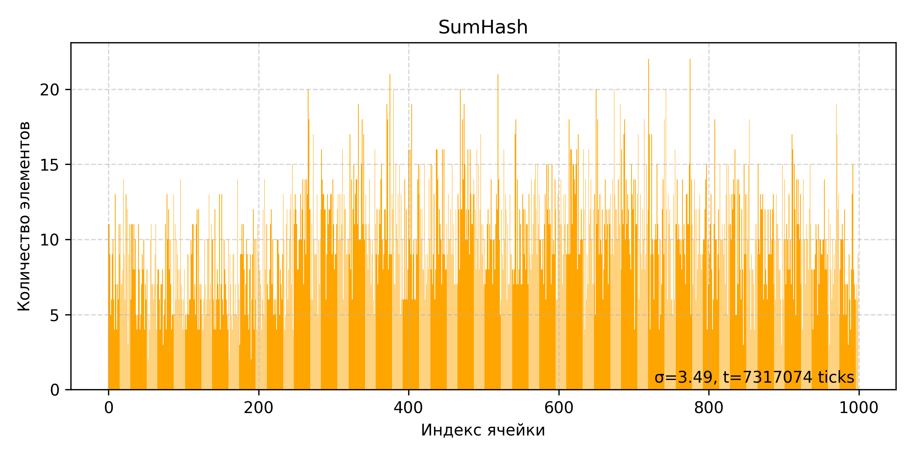
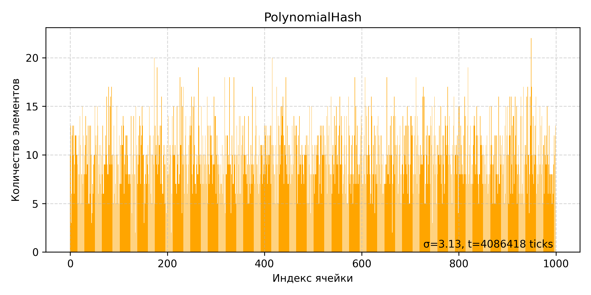
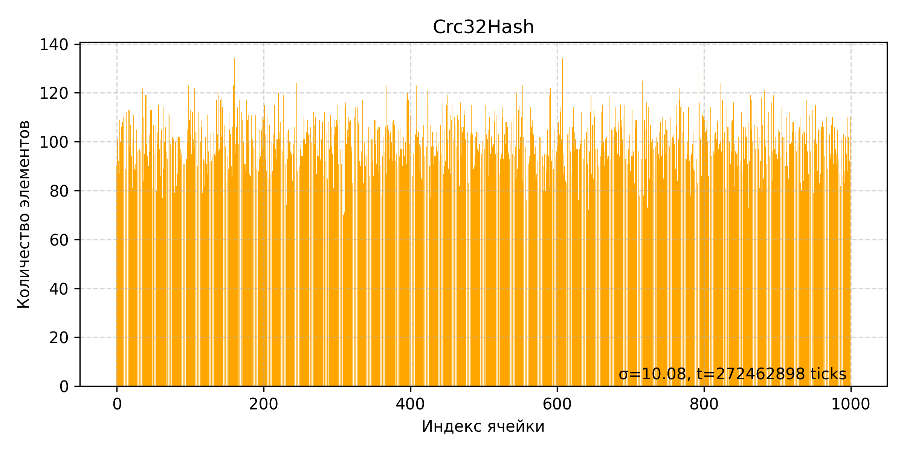
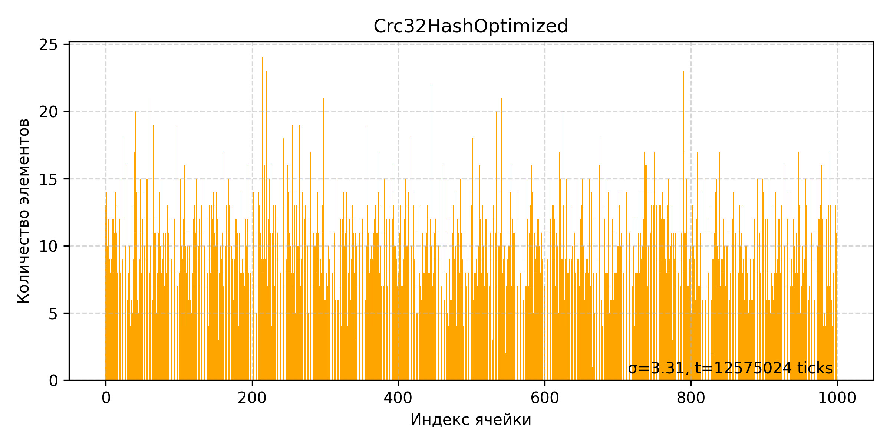
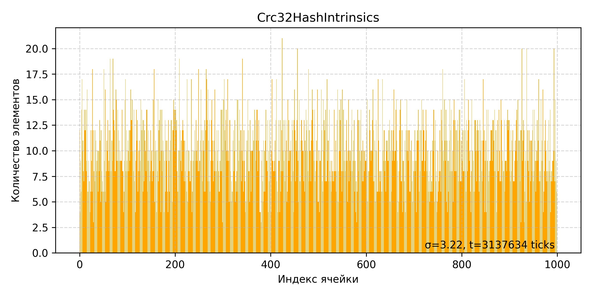
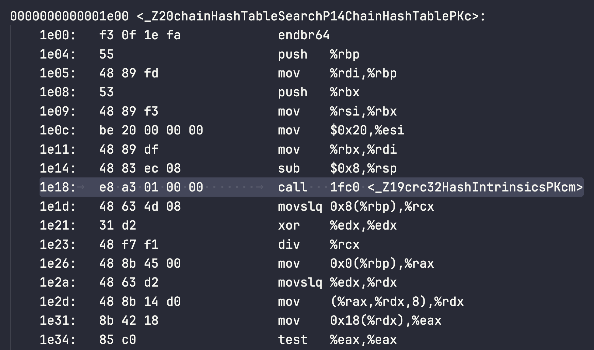

# Hash Table

## Содержание

1. [О проекте](#о-проекте)
2. [Задача](#задача)
3. [Структура хеш-таблицы](#структура-хеш-таблицы)
4. [Структура linked-list](#структура-linked-list)
5. [Среда и инструменты](#среда-и-инструменты)
6. [Методика измерений](#методика-измерений)
7. [Профилирование](#профилирование)
8. [Сравнение хеш-функций](#сравнение-хеш-функций)
9. [Оптимизация: этапы и результаты](#оптимизация-этапы-и-результаты)

   1. [Версия v0 — без оптимизаций (`-Odefault`)](#версия-v0-—-без-оптимизаций--odefault-)
   2. [Версия v1 — флаги компиляции `-O3`](#версия-v1-—-флаги-компиляции--o3-)
   3. [Версия v2 — оптимизация `strcmp`](#версия-v2-—-оптимизация-strcmp)
   4. [Версия v3 — `crc32` optimized](#версия-v3---crc32-optimized)
   5. [Версия v4 — `crc32` intrinsics](#версия-v4---crc32-intrinsics)
10. [Итоги и выводы](#итоги-и-выводы)
11. [Приложения](#приложения)

---

## О проекте

В данной работе проводится оптимизация реализации хеш-таблицы с разрешением коллизий методом цепочек. Основная цель — системный подход к повышению производительности поиска ключа через итеративное профилирование и применение как программных, так и платформо-зависимых техник.

> [!NOTE]
> Выбран load factor ~ 7, в учебных целях для увеличения числа `strcmp`. В реальных проектах такой высокий load factor обычно не используется.

Длина ключей ограничена 32 байтами.

---

## Сборка и запуск проекта

Для сборки проекта выполните следующие шаги из корневой папки репозитория:

1. **Создать директорию для сборки**
```bash
mkdir -p build
```

2. **Запустить CMake с нужными опциями**

```bash
cmake \
    -DHASH_FUNCTION=<выбранная_хэш_функция> \
    -DCMAKE_BUILD_TYPE=<конфигурация> \
    -S . -B build
```

* **Параметр `HASH_FUNCTION`** — выбирает алгоритм хеширования:

    * `sumHash`
    * `polynomialHash`
    * `crc32Hash`
    * `crc32HashOptimized`
    * `crc32HashIntrinsics`
* **Параметр `CMAKE_BUILD_TYPE`** — конфигурация сборки:

    | Опция     | Описание                                | Флаги компилятора                            |
    | --------- | --------------------------------------- | -------------------------------------------- |
    | `Debug`   | Отладочная сборка                       | `-O0 -g -Wall -Wextra …` (см. `DEBUG_FLAGS`) |
    | `Release` | Оптимизированная сборка                 | `-O3 -march=native -mtune=native -mavx2`     |
    | `Default` | Общая конфигурация по умолчанию (Debug) | `-g -std=c++20 -march=native -mtune=native`  |

3. **Перейти в директорию сборки**

```bash
cd build
```

4. **Запустить компиляцию**

```bash
make
```

5. **Исполняемые файлы**
   После успешной сборки все бинарники появятся в папке

```
/build/bin/
```

## Задача

1. Разработка Chain Hash Table на основе cache-friendly связного списка.
2. Проверка корректности работы хеш-таблицы с помощью unit-тестов.
3. Бенчмарк различных хеш-функций: замеры производительности и выбор наиболее оптимальной для использования в хеш-таблице.
4. Бенчмарк хеш-таблицы: 10000 поисков по полному словарю из 10000 уникальных слов.
5. Выявление узких мест программы с помощью `valgrind --tool=cachegrind`.
6. Программные и аппаратно-зависимые оптимизации с последующим анализом прироста производительности.
7. Прекращение оптимизаций, когда прирост становится незначительным в сравнении с ухудшением читаемости и структуры кода.

> [!NOTE]
> Перед бенчмарками выполняется `NUMBER_OF_WARMUP_TESTS` прогонов для прогрева кешей и установления стабильной температуры процессора.

---

## Структура хеш-таблицы

```c
struct ChainHashTable {
    LinkedList** buckets = NULL;
    int   capacity       = 0;
    int   size           = 0;
    stringHashFunction* hashFunction = {};
};
```

---

## Структура linked-list

```c
struct Element {
    char* key;
    uint64_t hash;
};

struct LinkedList {
    Element*  data;
    int*      next;
    int*      prev;
    int       size;
    int       capacity;
    int       free;
    char*     dump_file;
};
```
Особенности реализации:
* Кэш френдли структура данных засчет массивов

---

## Среда и инструменты

* **Компилятор:** GCC 11.4.0
* **Система:** Linux x86\_64
* **Профилировщики:** Valgrind (Cachegrind)
* **Язык:** C/C++ (inline ASM / NASM)

### Параметры среды

|    *Параметр*          |           *Значение*               |
|------------------------|------------------------------------|
|   Architecture         |     x86_64                         |
|  CPU op-mode(s)        |   32-bit, 64-bit                   |
|  Address sizes         |  40 bits physical, 48 bits virtual |
|  Byte Order            |   Little Endian                    |
| CPU(s)                 |     1                              |
|Caches (sum of all)     |                                    |
|  L1d                   |   32 KiB (1 instance)              |
|  L1i                   |   32 KiB (1 instance)              |
|  L2                    |   4 MiB (1 instance)               |
|  L3                    |   16 MiB (1 instance)              |


---

## Методика измерений

1. **Файл ключей:** слова по одному, длина ≤32 байт, выравнивание 32.
2. **Разогрев:** 1000 поисков без учета времени.
3. **Основная фаза:** 10000 вызовов `chainHashTableSearch`, замеры через `__rdtsc`.
4. **Анализ результатов:**
- Вычисление среднего времени: $\mu = \frac{1}{n}\sum_{i=1}^{n} t_i$
- Вычисление дисперсии и стандартного отклонения: $\sigma^2 = \frac{1}{n}\sum_{i=1}^{n} (t_i - \mu)^2$
- Сравнение версий: $(T_{prev} - T_{curr}) / T_{prev} * 100\%$

---

## Профилирование

```bash
valgrind --tool=cachegrind ./bin/HashTableBenchmark
```

```bash
callgrind_annotate cachegrind.out.161068 > cacheout.txt
```

---
<!--
## Сравнение хеш-функций

```c
uint64_t sumHash            (const char* key, size_t length);
uint64_t polynomialHash     (const char* key, size_t length);
uint64_t crc32Hash          (const char* key, size_t length);
uint64_t crc32HashOptimized (const char* key, size_t length);
uint64_t crc32HashIntrinsics(const char* key, size_t length);
```

Для каждой функции:

- График распределения элементов сформированного словаря (файл `TestsSrc/Tests.txt`) по `bucket-ам`
- Время, которое потребовалось для распределения слов
- Дисперсия $\sigma$

### sumHash

* **График времени поиска:**

* **Таблица результатов:**

| Функция | Время построения, ticks | Дисперсия  |
| ------- |    -----------------    | ---------- |
| sumHash |      $73,2 * 10^5$      |   $3.49$   |

```c
uint64_t sumHash(const char* key, size_t length) {
    warning(key, ErrorHashReturnValue);

    uint64_t sum = 0;
    uint64_t mod = (uint64_t)(1e9 + 7);
    while (*key != '\0') {
        sum += (unsigned char)*key;
        key++;
    }
    return sum % mod;
}
```
---

### polynomialHash

* **График времени поиска:**


* **Таблица результатов:**

| Функция        | Среднее время, мс | Дисперсия  |
| -------------- | ----------------- | ---------- |
| polynomialHash |   $40,9 * 10^5$   | $3.13$     |

```c
uint64_t polynomialHash(const char* key, size_t length) {
    warning(key, ErrorHashReturnValue);

    const uint64_t base = 255;
    uint64_t mod = (uint64_t)(1e9 + 7);
    uint64_t hash = 0;
    while (*key != '\0') {
        hash = (hash * base + (unsigned char)(*key)) % mod;
        key++;
    }

    return hash;
}
```

---

### crc32Hash

* **График времени поиска:**

* **Таблица результатов:**
| Функция   | Среднее время, мс | Дисперсия  |
| --------- | ----------------- | ---------- |
| crc32Hash |   $343,7 * 10^5$  | $3.31$     |

```c
const uint64_t Polynomial = 0xEDB88320;

uint64_t crc32Hash(const char* key, size_t length) {
    warning(key, ErrorHashReturnValue);

    uint64_t crc = 0xFFFFFFFF;
    unsigned char* current = (unsigned char*) key;
    while (length--) {
        crc ^= *current++;
        for (uint64_t j = 0; j < 8; j++) {
            if (crc & 1) {
                crc = (crc >> 1) ^ Polynomial;
            } else {
                crc =  crc >> 1;
            }
        }
    }

    return ~crc;
}
```

---

### crc32HashOptimized

* **График времени поиска:**

* **Таблица результатов:**

| Функция            | Среднее время, мс | Дисперсия  |
| ------------------ | ----------------- | ---------- |
| crc32HashOptimized |   $125,8 * 10^5$  | $3.31$     |

```c
uint64_t crc32HashOptimized(const char* key, size_t length) {
    warning(key, ErrorHashReturnValue);

    uint64_t crc = 0xFFFFFFFF;
    unsigned char* current = (unsigned char*) key;
    while (length--) {
        crc ^= *current++;
        for (uint64_t j = 0; j < 8; j++) {
            crc = (crc >> 1) ^ (-(int)(crc & 1) & Polynomial);
        }
    }

    return ~crc;
}
```

По результатам бенчмарков хеш-функций была выбрана `polynomialHash`. Она продемонстрировала оптимальное соотношение времени формирования таблицы и распределения. -->

## Оптимизация: этапы и результаты

### Версия v0 — без флагов оптимизаций (polynomialHash) (`-Odefault`)

* **Среднее время (10000 поисков):** $6735 * 10^4$ ticks
* **Улучшение:** 0% (базовая версия)
* **Дамп Cachegrind (упрощенный):**

```
31,837,574,916 (46.10%) polynomialHash(char const*, unsigned long)
20,026,664,518 (29.00%) chainHashTableSearch(ChainHashTable*, char const*)
14,558,983,709 (21.08%) ./string/../sysdeps/x86_64/multiarch/strcmp-avx2.S:__strcmp_avx2
```

### Версия v1 — флаги компиляции (polynomialHash) `-O3`

* **Флаги:** `-O3 -std=c++20 -march=native -mtune=native`
* **Среднее время:** $359 * 10^4$ ticks
* **Улучшение относительно `v1`:** -
* **Улучшение относительно предыдущей версии:** 94.7 % (1,94x)
* **Дамп Cachegrind:**

```
25,780,649,935 (48.99%) polynomialHash(char const*, unsigned long)
14,558,983,709 (27.67%) ./string/../sysdeps/x86_64/multiarch/strcmp-avx2.S:__strcmp_avx2
10,381,934,112 (19.73%) chainHashTableSearch(ChainHashTable*, char const*)
```
Как можно заметить `polynomialHash` является самым узким местом программы. Чтобы оптимизировать хэш функцию используем огроничения, наложенные на входные данные **все слова короче 32 символов**. Перепишем функцию `crc32Hash` на Intel Intrinsics.

### Версия v2 — `crc32HashIntrinsics`

#### crc32HashIntrinsics

* **График времени поиска:**

* **Таблица результатов:**

| Функция             | Среднее время, мс | Дисперсия  |
| ------------------- | ----------------- | ---------- |
| crc32HashIntrinsics |   $31,4 * 10^5$  | $3.22$      |

```c
uint64_t crc32HashIntrinsics(const char* key, size_t length) {
    warning(key, ErrorHashReturnValue);

    uint64_t crc = 0xFFFFFFFF;

    uint64_t string_key1 = 0;
    uint64_t string_key2 = 0;
    uint64_t string_key3 = 0;
    uint64_t string_key4 = 0;

    crc = _mm_crc32_u64(crc, *((uint64_t*)key + 0));
    crc = _mm_crc32_u64(crc, *((uint64_t*)key + 8));
    crc = _mm_crc32_u64(crc, *((uint64_t*)key + 16));
    crc = _mm_crc32_u64(crc, *((uint64_t*)key + 24));

    return crc;
}
```

* **Описание:** Хэш функция использует векторные инструкции, `_mm_crc32_u64`/`_mm_crc32_u32`.
* **Среднее время:** $186 * 10^4$ ticks
* **Улучшение относительно `v1`:** 48.2 %
* **Улучшение относительно предыдущей версии:** 48.2 %
* **Дамп Cachegrind:**

```
14,647,103,424 (52.46%) ./string/../sysdeps/x86_64/multiarch/strcmp-avx2.S:__strcmp_avx2
10,633,125,198 (38.08%) chainHashTableSearch(ChainHashTable*, char const*)
   735,000,000 ( 2.63%) crc32HashIntrinsics(char const*, unsigned long)
   630,192,058 ( 2.26%) hashTableSearchTest(ChainHashTable*, Buffer<char*>*)
```

### Версия v3 — оптимизация `strcmp`

```c
    asm volatile (
        "vmovdqu (%1), %%ymm0           \n\t" // load 32 bytes from ptr1 to ymm0
        "vmovdqu (%2), %%ymm1           \n\t" // load 32 bytes from ptr2 to ymm1
        "vpcmpeqb %%ymm0, %%ymm1, %%ymm0\n\t" // ymm0 = (ymm0 == [ptr2])
        "vpmovmskb %%ymm0, %0           \n\t" //  cmp_result = movemask(ymm0)
        "vzeroupper                     \n\t"
        : "=r"(cmp_result)                    // вывод в любой регистр
        : "r"(llist->data[index].key),        // %1 = ptr1
          "r"(key)                            // %2 = ptr2
        : "ymm0", "ymm1", "memory"            // clobber: ymm0/1, memory
    );
```

* **Описание:** `assembly inline strcmp` для ключей ≤32 байт.
* **Среднее время:** $143 * 10^4$ ticks
* **Улучшение относительно `v1`:** 60.2 %
* **Улучшение относительно предыдущей версии:** 23.1 %
* **Дамп Cachegrind:**

```
12,640,829,997 (90.18%) chainHashTableSearch(ChainHashTable*, char const*)
   734,999,993 ( 5.24%) crc32HashIntrinsics(char const*, unsigned long)
   630,192,059 ( 4.50%) hashTableSearchTest(ChainHashTable*, Buffer<char*>*)
```

### Версия v4 — оптимизация `inline hash function`

Для того, чтобы заинлайнить функцию хэширования, добавим к определению модификатор `inline` и перенесем функцию в хедер.



Изучая objdump заметим, что несмотря на наши подсказки функция не была заинлайнина, поэтому нам ничего не остаётся как сделать это вручную.

* **Описание:** Заменим вызов функции `crc32HashIntrinsics` через указатель на inline этой функции.
* **Среднее время:** $120 * 10^4$ ticks
* **Улучшение относительно `v1`:** 66.5 %
* **Улучшение относительно предыдущей версии:** 16.1 %

```c
#define HASH_FUNCTION_INLINE(key, hash)                               \
    hash = 0xFFFFFFFF;                                                \
                                                                      \
    uint64_t string_key1 = 0;                                         \
    uint64_t string_key2 = 0;                                         \
    uint64_t string_key3 = 0;                                         \
    uint64_t string_key4 = 0;                                         \
                                                                      \
    hash = _mm_crc32_u64(hash, *((uint64_t*)key + 0));                \
    hash = _mm_crc32_u64(hash, *((uint64_t*)key + 8));                \
    hash = _mm_crc32_u64(hash, *((uint64_t*)key + 16));               \
    hash = _mm_crc32_u64(hash, *((uint64_t*)key + 24));
```

```c
__attribute__((target("avx2")))
ChainHashTableSearchStatus chainHashTableSearch(ChainHashTable* hash_table, const char* key) {
    warning(hash_table, NOT_FOUND);

    uint64_t hash = 0;
    HASH_FUNCTION_INLINE(key, hash);
    int bucket_index = hash % hash_table->capacity;
    ...
}
```

## Вывод

Ниже итоговая сводная таблица по всем версиям:

| Версия | Ср. время (ticks·10^4) | Улучшение vs v1 | Улучшение vs пред. |
| :----: | :-------------------: | :-------------: | :----------------: |
| **v0 - без оптимизаций** |          6735         |         —       |          —         |
| **v1 — флаги компиляции** |          359          |         —       |       94.7 %       |
| **v2 - интринсики** |          186          |      48.2 %     |       48.2 %       |
| **v3 — оптимизация strcmp** |          143          |      60.2 %     |       23.1 %       |
| **v4 - inline хэш функции** |          120          |      66.5 %     |       16.1 %       |

* **Улучшение vs v1** = $(T_1 − T_n) / T₁ × 100%$, где $T_1=359$ — время v1.
* **Улучшение vs пред.** = $(T\_{prev} − T_n) / T_{prev} × 100%$.

---
