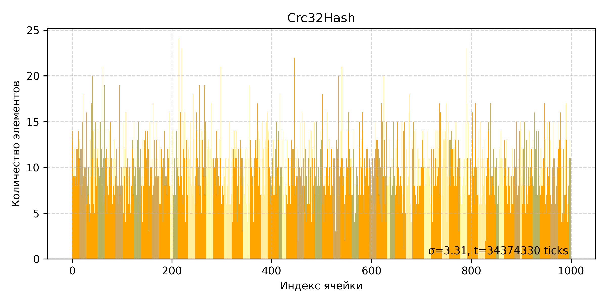

# Hash Table

## Содержание

1. [О проекте](#о-проекте)
2. [Задача](#задача)
3. [Структура хеш-таблицы](#структура-хеш-таблицы)
4. [Структура linked-list](#структура-linked-list)
5. [Среда и инструменты](#среда-и-инструменты)
6. [Методика измерений](#методика-измерений)
7. [Профилирование](#профилирование)
8. [Сравнение хеш-функций](#сравнение-хеш-функций)
9. [Оптимизация: этапы и результаты](#оптимизация-этапы-и-результаты)

   1. [Версия v0 — без оптимизаций (`-Odefault`)](#версия-v0-—-без-оптимизаций--odefault-)
   2. [Версия v1 — компиляторные флаги `-O3`](#версия-v1-—-компиляторные-флаги--o3-)
   3. [Версия v2 — оптимизация `strcmp`](#версия-v2-—-оптимизация-strcmp)
   4. [Версия v3 — `crc32` optimized](#версия-v3---crc32-optimized)
   5. [Версия v4 — `crc32` intrinsics](#версия-v4---crc32-intrinsics)
10. [Итоги и выводы](#итоги-и-выводы)
11. [Приложения](#приложения)

---

## О проекте

В данной работе проводится оптимизация реализации хеш-таблицы с разрешением коллизий методом цепочек. Основная цель — системный подход к повышению производительности поиска ключа через итеративное профилирование и применение как программных, так и платформо-зависимых техник.

> \[!NOTE]
> Выбран load factor ~ 7, в учебных целях для увеличения числа `strcmp`. В реальных проектах такой высокий load factor обычно не используется.

Длина ключей ограничена 32 байтами.

---

## Задача

1. Разработка Chain Hash Table на основе cache-friendly связного списка.
2. Проверка корректности работы хеш-таблицы с помощью unit-тестов.
3. Бенчмарк различных хеш-функций: замеры производительности и выбор наиболее оптимальной для использования в хеш-таблице.
4. Бенчмарк хеш-таблицы: 10000 поисков по полному словарю из 10000 уникальных слов.
5. Выявление узких мест программы с помощью `valgrind --tool=cachegrind`.
6. Программные и аппаратно-зависимые оптимизации с последующим анализом прироста производительности.
7. Прекращение оптимизаций, когда прирост становится незначительным в сравнении с ухудшением читаемости и структуры кода.

> \[!NOTE] Перед бенчмарками выполняется `NUMBER_OF_WARMUP_TESTS` прогонов для прогрева кешей и установления стабильной температуры процессора.

---

## Структура хеш-таблицы

```c
struct ChainHashTable {
    LinkedList** buckets = NULL;
    int   capacity       = 0;
    int   size           = 0;
    stringHashFunction* hashFunction = {};
};
```

---

## Структура linked-list

```c
struct Element {
    char* key;
    uint64_t hash;
};

struct LinkedList {
    Element*  data;
    int*      next;
    int*      prev;
    int       size;
    int       capacity;
    int       free;
    char*     dump_file;
};
```
Особенности реализации:
* Кэш френдли структура данных засчет массивов

---

## Среда и инструменты

* **Компилятор:** GCC/Clang 13+
* **Система:** Linux x86\_64
* **Профилировщики:** Valgrind (Cachegrind)
* **Язык:** C/C++ (inline ASM / NASM)

---

## Методика измерений

1. **Файл ключей:** слова по одному, длина ≤32 байт, выравнивание 32.
2. **Разогрев:** 1000 поисков без учета времени.
3. **Основная фаза:** 10000 вызовов `chainHashTableSearch`, замеры через `__rdtsc`.
4. **Анализ:** среднее время, σ‑отклонение, фильтрация выбросов (>3σ)
- Вычисление среднего времени
$\mu = \frac{1}{n}\sum_{i=1}^{n} t_i$
- Вычисление дисперсии и стандартного отклонения:
$\sigma^2 = \frac{1}{n}\sum_{i=1}^{n} (t_i - \mu)^2$
$\quad$
$\sigma = \sqrt{\sigma^2}$

5. **Сравнение версий:** $(T_{prev} - T_{curr}) / T_{prev} * 100\%$

---

## Профилирование

```bash
valgrind --tool=cachegrind ./bin/HashTableBenchmark
```

```bash
callgrind_annotate cachegrind.out.161068 > cacheout.txt
```

---

## Сравнение хеш-функций

```c
uint64_t sumHash            (const char* key, size_t length);
uint64_t polynomialHash     (const char* key, size_t length);
uint64_t crc32Hash          (const char* key, size_t length);
uint64_t crc32HashOptimized (const char* key, size_t length);
uint64_t crc32HashIntrinsics(const char* key, size_t length);
```

Для каждой функции:

- График распределения элементов сформированного словаря (файл `TestsSrc/Tests.txt`) по `bucket-ам`
- Время, которое потребовалось для распределения слов
- Дисперсия $\sigma$

### sumHash

* **График времени поиска:**

* **Таблица результатов:**
| Функция | Время построения, ticks | Дисперсия  |
| ------- | ----------------- | ---------- |
| sumHash |   $73,2 * 10^5$         | $3.49$       |

```c
uint64_t sumHash(const char* key, size_t length) {
    uint64_t sum = 0;
    uint64_t mod = (uint64_t)(1e9 + 7);
    while (*key != '\0') {
        sum += (unsigned char)*key;
        key++;
    }
    return sum % mod;
}
```
---

### polynomialHash

* **График времени поиска:**

* **Таблица результатов:**
| Функция        | Среднее время, мс | Дисперсия  |
| -------------- | ----------------- | ---------- |
| polynomialHash |   $40,9 * 10^5$         | $3.13$       |

```c
uint64_t polynomialHash(const char* key, size_t length) {
    const uint64_t base = 255;
    uint64_t mod = (uint64_t)(1e9 + 7);
    uint64_t hash = 0;
    while (*key != '\0') {
        hash = (hash * base + (unsigned char)(*key)) % mod;
        key++;
    }

    return hash;
}
```

---

### crc32Hash

* **График времени поиска:**

* **Таблица результатов:**
| Функция   | Среднее время, мс | Дисперсия  |
| --------- | ----------------- | ---------- |
| crc32Hash |   $343,7 * 10^5$         | $3.31$       |

```c
const uint64_t Polynomial = 0xEDB88320;

uint64_t crc32Hash(const char* key, size_t length) {
    uint64_t crc = 0xFFFFFFFF;
    unsigned char* current = (unsigned char*) key;
    while (length--) {
        crc ^= *current++;
        for (uint64_t j = 0; j < 8; j++) {
            if (crc & 1) {
                crc = (crc >> 1) ^ Polynomial;
            } else {
                crc =  crc >> 1;
            }
        }
    }

    return ~crc;
}
```

---

### crc32HashOptimized

* **График времени поиска:**

* **Таблица результатов:**

| Функция            | Среднее время, мс | Дисперсия  |
| ------------------ | ----------------- | ---------- |
| crc32HashOptimized |   $125,8 * 10^5$  | $3.31$       |

```c
uint64_t crc32HashOptimized(const char* key, size_t length) {
    uint64_t crc = 0xFFFFFFFF;
    unsigned char* current = (unsigned char*) key;
    while (length--) {
        crc ^= *current++;
        for (uint64_t j = 0; j < 8; j++) {
            crc = (crc >> 1) ^ (-(int)(crc & 1) & Polynomial);
        }
    }

    return ~crc;
}
```
---

### crc32HashIntrinsics

* **График времени поиска:**

* **Таблица результатов:**

| Функция             | Среднее время, мс | Дисперсия  |
| ------------------- | ----------------- | ---------- |
| crc32HashIntrinsics |   $31,4 * 10^5$  | $3.22$     |

```c
uint64_t crc32HashIntrinsics(const char* key, size_t length) {
    uint64_t crc = 0xFFFFFFFF;

    uint64_t string_key1 = 0;
    uint64_t string_key2 = 0;
    uint64_t string_key3 = 0;
    uint64_t string_key4 = 0;

    memcpy(&string_key1, key + 0, 8);
    memcpy(&string_key2, key + 8, 8);
    memcpy(&string_key3, key + 16, 8);
    memcpy(&string_key4, key + 24, 8);

    crc = _mm_crc32_u64(crc, string_key1);
    crc = _mm_crc32_u64(crc, string_key2);
    crc = _mm_crc32_u64(crc, string_key3);
    crc = _mm_crc32_u64(crc, string_key4);

    return crc;
}
```

---

По результатам бенчмарков хеш-функций была выбрана crc32HashIntrinsics. Она продемонстрировала оптимальное соотношение времени формирования таблицы и распределения.

## Оптимизация: этапы и результаты

### Версия v0 — без оптимизаций (`-Odefault`)

* **Среднее время (10000 поисков):** 2494760 ticks
* **Улучшение:** 0% (базовая версия)
* **Дамп Cachegrind:**

```

```

### Версия v1 — компиляторные флаги `-O3`

* **Флаги:** `-O3 -march=native -g`
* **Среднее время:** *insert time* ticks
* **Улучшение относительно `-Odefault`:** *X1*%
* **Улучшение относительно предыдущей версии:** *X*% относительно v0
* **Дамп Cachegrind:**

```

```

### Версия v2 — оптимизация `strcmp`

* **Описание:** ручная развёртка или замена `strcmp` для ключей ≤32 байт.
* **Среднее время:** *insert time* ticks
* **Улучшение относительно `-Odefault`:** *X2*%
* **Улучшение относительно предыдущей версии:** *X*% относительно v1
* **Дамп Cachegrind:**

```

```

### Версия v3 — `crc32` optimized

* **Описание:** таблица и unroll в реализации CRC32.
* **Среднее время:** *insert time* ticks
* **Улучшение относительно `-Odefault`:** *X3*%
* **Улучшение относительно предыдущей версии:** *X*% относительно v2
* **Дамп Cachegrind:**

```

```

### Версия v4 — `crc32` intrinsics

* **Описание:** `_mm_crc32_u64`/`_mm_crc32_u32`.
* **Среднее время:** *insert time* ticks
* **Улучшение относительно `-Odefault`:** *X4*%
* **Улучшение относительно предыдущей версии:** *X*% относительно v3
* **Дамп Cachegrind:**

```

```

---

## Вывод

---
